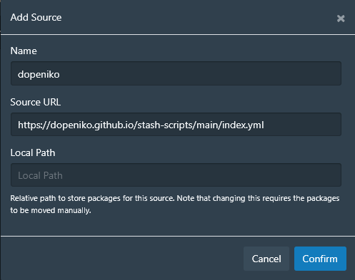

### How do I install and use these plugins?

1. Follow the [Stash guide on adding a plugin source](https://docs.stashapp.cc/plugins/#adding-sources)
2. Add this repository with Source index URL: `https://dopeniko.github.io/stash-scripts/main/index.yml` 
3. Before installing any plugins, read the documentation to ensure you have all the required dependencies

## Plugins

### [Discord Presence](plugins/discordPresence/)

Display your currently playing scene in your Discord activity. (I am not responsible for any mishaps)

### [Jump to Now Playing](plugins/jumpToNowPlaying)

Adds a button on the queue control to scroll back to the currently playing video.

## Themes and UI tweaks

### [Dope Theme](plugins/themeDope/)

My personal theme, with a customisable base colour.

### [No Scene Card Popovers](/plugins/themeNoSceneCardPopovers/)

Remove popovers footer from scene cards.

## Plugin libraries

### [Dev Plugin Helper](plugins/pluginDev/)

Helper script if you want to develop your own plugin or theme. Adds `http://localhost:8080/plugin.js` and `http://localhost:8080/plugin.css` to the page.

### [Font Loader](plugins/cssThemeDev)

Allows your theme to fetch fonts from external CDNs (workaround for `font-src` CSP directive on Firefox).
